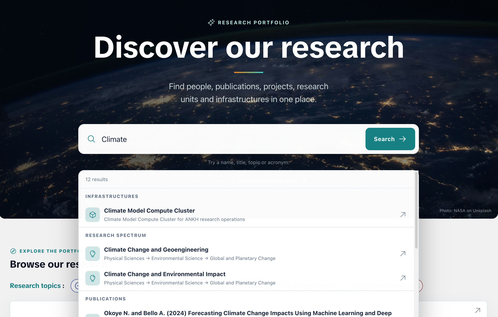
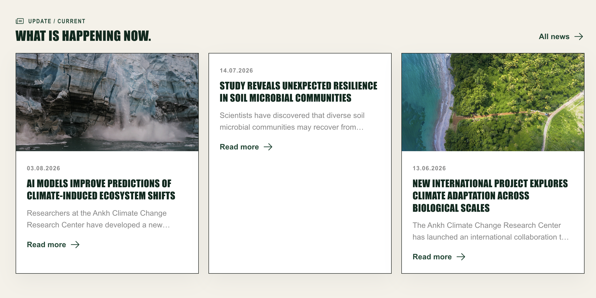
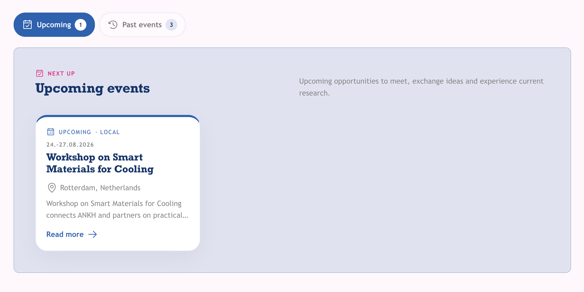
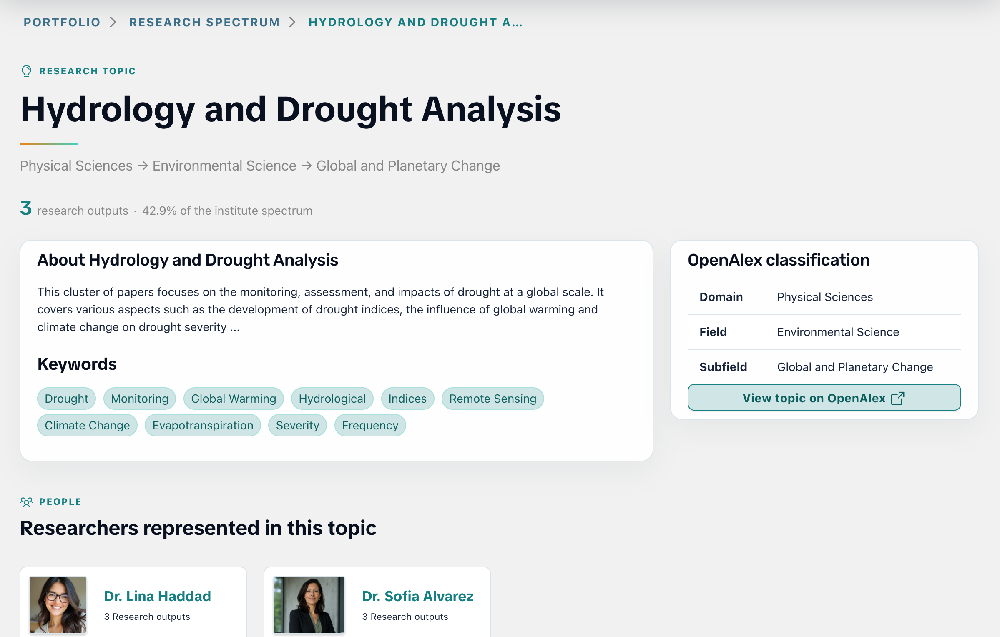
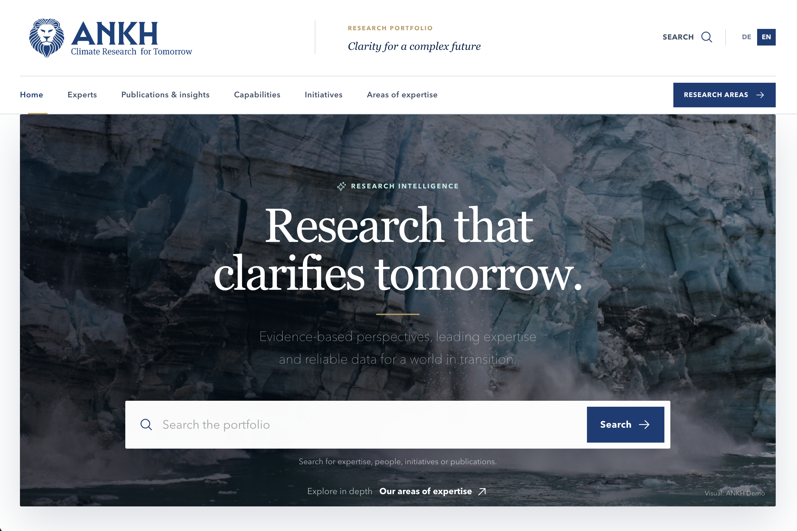

Forschungsinformationen zu erfassen ist wichtig. Aber ihr eigentlicher Wert entfaltet sich erst dann, wenn sie auch gefunden, verstanden und miteinander in Verbindung gebracht werden können.

Genau hier setzt **das neue OSIRIS Portfolio** an.

Die neue Version ist nicht einfach ein visuelles Update. Wir haben mit euch gesprochen, zugehört und dann grundlegend neu gedacht, wie Forschungseinrichtungen ihre Arbeit im Web präsentieren können: weg von einer rein strukturellen Abbildung des Organigramms, hin zu einem eigenständigen Forschungsportal, das Menschen Orientierung gibt, Zusammenhänge sichtbar macht und wissenschaftliche Inhalte gezielt auffindbar werden lässt.

> Diese Seite verwendet bewusst Screenshots aus unterschiedlichen Demo-Instanzen, um die Flexibilität von Portfolio zu zeigen. Die Inhalte stammen aus einer Testinstanz von OSIRIS und sind nicht realen Personen oder Projekten zugeordnet. 
> Bitte beachtet, dass einige der hier gezeigten Funktionen eine **OSIRIS Version 2.1** oder höher erfordern.

## TL;DR: Das neue Portfolio in Kürze

- Das neue Portfolio bietet eine echte Startseite für die Forschung.
- Die Suche erstreckt sich über alle Forschungsinhalte.
- Übersichtsseiten schaffen wirklich Übersicht.
- Inhalte lassen sich dynamisch filtern und durchsuchen.
- News, Events und Landingpages für Forschungsschwerpunkte und Organisationseinheiten machen die Forschungsleistung sichtbar.
- Die Inhalte lassen sich individuell gestalten und an das Corporate Design der Einrichtung anpassen.
- Lernt mehr über Portfolio auf [osiris-portfolio.de](https://osiris-portfolio.de) und schaut euch die verschiedenen Beispieldesigns an, z.B. [Demo 1](https://demo.osiris-portfolio.de) oder [Demo 4](https://demo4.osiris-portfolio.de).

## Das Problem: Die Daten sind da – aber die Geschichten fehlen

In einem Forschungsinformationssystem wie OSIRIS steckt unglaublich viel Wissen:

- Wer forscht an welchen Themen?
- Welche Publikationen sind entstanden?
- Welche Projekte laufen aktuell?
- Welche Infrastrukturen stehen zur Verfügung?
- Welche Einrichtungen arbeiten miteinander zusammen?
- Welche Veranstaltungen finden demnächst statt?
- Welche neuen Ergebnisse oder Entwicklungen sind besonders relevant?

Diese Informationen sind häufig vollständig vorhanden. Trotzdem bleiben sie nach außen unsichtbar oder verteilen sich auf zahlreiche Unterseiten, Redaktionssysteme und manuell gepflegte Listen.

Für Forschende bedeutet das oft doppelte Arbeit. Publikationen werden in OSIRIS eingetragen, anschließend aber noch einmal auf einer persönlichen Webseite gepflegt. Projektinformationen stehen im Forschungsinformationssystem, müssen für die Institutswebseite jedoch erneut aufbereitet werden. Neue Teammitglieder oder geänderte Organisationseinheiten müssen an mehreren Stellen aktualisiert werden.

Für Besucher:innen entsteht währenddessen ein anderes Problem: Sie müssen bereits wissen, wonach sie suchen.

Wer die interne Struktur einer Einrichtung nicht kennt, kann mit einem Organigramm allein wenig anfangen. Eine Journalistin sucht vielleicht eine Expertin für ein bestimmtes Thema. Ein Unternehmen sucht eine passende Forschungsinfrastruktur. Ein Nachwuchswissenschaftler interessiert sich für laufende Projekte. Eine Förderorganisation möchte sehen, welche Ergebnisse aus einem Forschungsbereich hervorgegangen sind.

Diese Menschen denken nicht in internen Zuständigkeiten. Sie denken in Fragen, Themen und Zusammenhängen.

Das neue Portfolio setzt genau dort an.

## Eine echte Startseite für die Forschung

Die bisherige Portfolio-Startseite zeigte standardmäßig die oberste Organisationseinheit. Das war sachlich korrekt, fühlte sich aber eher wie eine Detailseite als wie ein echter Einstieg an.

Mit der neuen Version bekommt Portfolio deshalb eine neue Startseite, die als Eingangstor zur gesamten Forschungslandschaft einer Einrichtung funktioniert.

Im Mittelpunkt steht ein großer Search Hero. Besuchende können direkt nach Personen, Publikationen, Projekten, Organisationseinheiten, Infrastrukturen und weiteren Forschungsinhalten suchen. Sie müssen weder die interne Organisationsstruktur kennen noch zuerst entscheiden, in welchem Bereich der Webseite sich eine Information befinden könnte.

Unterhalb der Suche führen große Schnellzugriffe zu den wichtigsten Bereichen. Die Kacheln zeigen nicht nur, was verfügbar ist, sondern auch wie viel: Wie viele Forschende gehören zur Einrichtung? Wie viele Publikationen, Projekte oder Infrastrukturen sind öffentlich sichtbar?

Je nach Konfiguration können außerdem weitere Inhalte auf der Startseite erscheinen:

- aktuelle Nachrichten
- bevorstehende Veranstaltungen
- Forschungsschwerpunkte
- das institutionelle Forschungsspektrum
- eine interaktive Karte der weltweiten Kooperationen

So entsteht bereits auf der ersten Seite ein Eindruck davon, wie vielfältig, vernetzt und aktiv eine Einrichtung ist.

## Eine Suche über alle Forschungsinhalte

Eine gute Forschungswebseite darf nicht voraussetzen, dass Besucher:innen ihre Struktur bereits verstanden haben.

Deshalb basiert die neue Suche auf einem gemeinsamen Suchindex. Die Portfolio-API stellt dafür die freigegebenen Inhalte aus OSIRIS in einer einheitlichen Form bereit. Portfolio lädt diesen Index beim Erstellen der statischen Webseite und durchsucht ihn anschließend direkt im Browser.

Die Suche bleibt dadurch schnell und leichtgewichtig. Es ist kein zusätzlicher Suchserver notwendig, kein komplexer Dienst muss betrieben und keine Datenbank öffentlich erreichbar gemacht werden.

Gesucht werden kann über unterschiedliche Entitäten hinweg. Ein Suchbegriff kann beispielsweise gleichzeitig passende Ergebnisse aus folgenden Bereichen liefern:

- Personen
- Publikationen
- Forschungsaktivitäten
- Projekte
- Forschungsinfrastrukturen
- Organisationseinheiten
- Forschungsschwerpunkte
- Events

Das verändert die Nutzererfahrung grundlegend. Wer nach „Mikrobiom“, „Klimaanpassung“ oder „Machine Learning“ sucht, bekommt nicht nur eine einzelne Textseite angezeigt. Portfolio macht sichtbar, welche Menschen, Projekte, Publikationen und Strukturen mit diesem Begriff verbunden sind.

Aus einer Suche wird so ein Einstieg in das Forschungsnetzwerk der Einrichtung.

## Neue Übersichtsseiten, die wirklich Übersicht schaffen

In früheren Versionen waren viele Gesamtübersichten technisch an die oberste Organisationseinheit gekoppelt. Alle Publikationen waren damit beispielsweise eigentlich die Publikationen des Instituts. Das Ergebnis war zwar korrekt, wirkte in der Navigation aber unnötig indirekt.

Das neue Portfolio führt deshalb eigenständige Übersichtsseiten ein.

Publikationen, Projekte, Aktivitäten, Personen, Infrastrukturen, Organisationseinheiten und Forschungsschwerpunkte erhalten jeweils einen eigenen Einstieg. Die Seiten konzentrieren sich vollständig auf die jeweiligen Inhalte und verzichten auf Navigationselemente, die an dieser Stelle keinen Mehrwert bieten.

Große Datenbestände lassen sich über dynamische Filter eingrenzen – beispielsweise nach Jahr, Typ, Status oder organisatorischer Zuordnung. Die Filterung geschieht direkt im Browser und reagiert ohne erneutes Laden der Seite.

Das klingt zunächst nach einer kleinen Änderung. In der Praxis macht sie jedoch einen großen Unterschied: Besucher:innen sehen nicht mehr nur eine lange Liste. Sie können den Bestand selbst erkunden und schnell genau die Inhalte finden, die für sie relevant sind.

## News: Forschungsinformationen werden zu Wissenschaftskommunikation

Forschung besteht nicht nur aus abgeschlossenen Publikationen und formalen Projektdaten.

Manchmal ist die wichtigste Geschichte, dass ein neues Verbundprojekt startet. Dass ein Forschungsteam eine ungewöhnliche Entdeckung gemacht hat. Dass eine Infrastruktur erstmals öffentlich verfügbar ist. Oder dass Forschende eine aktuelle gesellschaftliche Debatte wissenschaftlich einordnen können.

Mit den neuen Newsseiten kann OSIRIS Portfolio deshalb auch redaktionelle Inhalte veröffentlichen.

Nachrichten können einen Titel, einen Teaser, ein Bild und einen ausführlichen Inhalt enthalten. Zusätzlich lassen sie sich mit bereits vorhandenen Informationen aus OSIRIS verbinden – etwa mit Personen, Projekten, Forschungsaktivitäten, Infrastrukturen oder Veranstaltungen.

Das ist für Wissenschaftskommunikation besonders wertvoll. Eine Nachricht bleibt nicht isoliert, sondern führt direkt zu den Hintergründen:

- Wer war beteiligt?
- Welches Projekt steht dahinter?
- Welche Publikationen gehören dazu?
- Welche Forschungsinfrastruktur wurde eingesetzt?
- Wo kann ich mehr über das Thema erfahren?

> Portfolio verbindet redaktionelles Erzählen mit strukturierten Forschungsinformationen. Das reduziert doppelte Pflege und schafft gleichzeitig deutlich reichhaltigere Inhalte.

Die technische Grundlage ist außerdem bereits auf zukünftige redaktionelle Workflows vorbereitet. Autor:innen, Veröffentlichungs- und Änderungsdaten sowie institutionelle Herausgeber können maschinenlesbar ausgezeichnet werden.

## Events: Was passiert als Nächstes?

Auch Veranstaltungen gehören zur sichtbaren Forschungsleistung einer Einrichtung, besonders in den Sozial- und Geisteswissenschaften. Konferenzen, Workshops, Vortragsreihen oder öffentliche Diskussionsveranstaltungen sind ein zentraler Bestandteil der wissenschaftlichen Kommunikation.

Das neue Portfolio kann öffentlich freigegebene Events aus OSIRIS darstellen. Auf der neuen Übersichtsseite werden bevorstehende und vergangene Veranstaltungen klar voneinander getrennt. Markierungen zeigen direkt, wie viele Einträge sich in beiden Bereichen befinden.

Bevorstehende Veranstaltungen können zusätzlich auf der Startseite hervorgehoben werden. So werden Konferenzen, Workshops, Vortragsreihen oder öffentliche Diskussionsveranstaltungen sichtbar, ohne dass sie in einem separaten Kalender verschwinden.

Auch hier entsteht Mehrwert durch Verknüpfungen: Zu einem Event können die dazugehörigen Beiträge und Forschungsaktivitäten angezeigt werden. Eine vergangene Konferenzseite bleibt dadurch langfristig relevant, weil sie dokumentiert, welche wissenschaftlichen Ergebnisse dort präsentiert wurden.

## Moderne Landingpages für Forschungsschwerpunkte

Forschungsschwerpunkte sind selten so eindeutig organisiert wie Abteilungen und Arbeitsgruppen.

Sie können „Research Areas“, „Programmbereiche“, „Schwerpunktthemen“ oder „Forschungsfelder“ heißen. Manche entsprechen organisatorischen Einheiten, andere verbinden mehrere Abteilungen miteinander. Gerade interdisziplinäre Themen verlaufen oft quer durch das Organigramm.

Die neuen Landingpages tragen dieser Vielfalt Rechnung.

Ein Forschungsschwerpunkt kann mit einem großen Hero-Bild, einer individuellen Farbe, einem charakteristischen Icon, beschreibenden Texten und den dazugehörigen Forschungsinhalten präsentiert werden. Statt wie ein weiterer Knoten im Organigramm zu wirken, bekommt er eine eigene Bühne.

Je nach vorhandenen Daten können Besucher:innen dort beispielsweise sehen:

- welche Personen am Thema arbeiten
- welche Organisationseinheiten beteiligt sind
- welche Projekte dazugehören
- welche Publikationen und Aktivitäten entstanden sind
- welche Infrastrukturen eine Rolle spielen
- wie sich das Thema im institutionellen Forschungsspektrum einordnet

Für Einrichtungen, die die bisherige Darstellung bevorzugen, bleibt die klassische Topic-Seite weiterhin verfügbar. Die gewünschte Ansicht lässt sich konfigurieren.

## Neue Landingpages für Organisationseinheiten

Auch die Seiten der Organisationseinheiten wurden grundlegend weiterentwickelt.

Die klassische Ansicht mit seitlicher Hierarchienavigation bleibt erhalten. Neu hinzu kommt eine moderne Landingpage, die stärker auf Inhalte, Identität und Orientierung ausgerichtet ist.

Abteilungen, Forschungsgruppen oder Institute können mit einem Hero-Bereich, einer Beschreibung, leitenden Personen und den wichtigsten Forschungsleistungen vorgestellt werden. Gleichzeitig bleibt die organisatorische Einordnung sichtbar:

- Welche Einheit ist übergeordnet?
- Welche Untereinheiten gehören dazu?
- Wo befindet sich die aktuelle Einheit innerhalb der Hierarchie?
- Wie gelangt man zurück zur Gesamtübersicht?

Damit vereint die neue Seite zwei Anforderungen, die sich häufig gegenüberstehen: Sie erzählt eine verständliche Geschichte über die Einheit und bildet trotzdem die institutionelle Struktur nachvollziehbar ab.

Ihr wollt lieber alles auf einen Blick sehen? Kein Problem: Die klassische Ansicht mit Hierarchienavigation bleibt weiterhin verfügbar. Welche Ansicht für eine Organisationseinheit angezeigt wird, lässt sich individuell konfigurieren.

## Forschung nicht nur auflisten, sondern verstehen

Portfolio soll nicht nur zeigen, **was** eine Einrichtung veröffentlicht hat. Es soll auch vermitteln, **woran** sie arbeitet.

Dafür kann das auf OpenAlex-Daten basierende Forschungsspektrum aus OSIRIS eingebunden werden. Thematische Zuordnungen aus den wissenschaftlichen Aktivitäten werden aggregiert und visuell aufbereitet.

Das Spektrum kann auf unterschiedlichen Ebenen erscheinen:

- bei einzelnen Forschenden
- auf Projektseiten
- bei Organisationseinheiten
- in Forschungsschwerpunkten
- als Gesamtübersicht der Einrichtung
- auf eigenen Detailseiten für einzelne OpenAlex Topics

Zeitliche Entwicklungen machen sichtbar, wie sich Themen verändern. Verknüpfungen zeigen, welche Personen, Einheiten und Forschungsleistungen zu einem Spektrum beitragen. Beschreibungen und Keywords helfen auch fachfremden Besucher:innen dabei, die Inhalte einzuordnen.

So wird aus einer langen Publikationsliste ein verständliches wissenschaftliches Profil. Ein netter Nebeneffekt: Die Inhalte lassen sich auch durch die Suche finden. Wer nach einem bestimmten Thema sucht, kann direkt sehen, welche Personen, Projekte und Publikationen damit verbunden sind.

## Gebaut für Menschen – und für Suchmaschinen

Eine Forschungswebseite kann inhaltlich hervorragend sein und trotzdem unsichtbar bleiben.

Portfolio berücksichtigt deshalb Suchmaschinenoptimierung nicht erst nachträglich, sondern bereits beim Erstellen der Seiten. Portfolio erzeugt statische HTML-Seiten mit vollständig gerenderten Inhalten. Suchmaschinen müssen keine komplexe Anwendung ausführen, um Titel, Texte oder Verknüpfungen zu erkennen.

Je nach Seitentyp werden zusätzlich strukturierte Daten nach [Schema.org](https://schema.org/) ausgegeben. Dazu gehören unter anderem:

- `NewsArticle` für Nachrichten
- `Event` für Veranstaltungen
- `ScholarlyArticle` für Publikationen
- `Person` für Forschendenprofile
- `Organization` für Organisationseinheiten
- `ResearchProject` für Projekte
- `CollectionPage` und `ItemList` für Übersichten

Canonical URLs, Sprachvarianten mit `hreflang`, XML-Sitemaps sowie Open-Graph- und Social-Media-Metadaten helfen Suchmaschinen und anderen Plattformen dabei, Inhalte korrekt zu verstehen und darzustellen.

Das verbessert nicht nur die klassische Google-Suche. Maschinenlesbare Informationen werden auch für wissenschaftliche Suchdienste, Wissensgraphen, KI-basierte Recherche und zukünftige Discovery-Systeme immer wichtiger. Wer sich mit den FAIR-Prinzipien beschäftigt, weiß: Sichtbarkeit ist ein entscheidender Faktor für die Wiederverwendbarkeit von Daten. Und Sichtbarkeit bedeutet heute nicht mehr nur, dass eine Seite existiert. Ihre Inhalte müssen technisch verständlich, eindeutig zugeordnet und dauerhaft erreichbar sein.

## Ein Forschungsportal, das wirklich zur Einrichtung passt

Forschungseinrichtungen unterscheiden sich erheblich – in ihrer Struktur, ihrer Sprache und ihrer visuellen Identität.

> Deshalb hat Portfolio bewusst kein Standarddesign.

Jede Einrichtung kann ein eigenes Theme erhalten. Header und Footer lassen sich vollständig austauschen. Farben, Schriften, Abstände, Rundungen und viele weitere Eigenschaften werden über Style Sheets angepasst. So kann Portfolio zurückhaltend und institutionell, modern und verspielt, elegant und unternehmerisch oder bewusst experimentell auftreten.

Auch die Texte innerhalb der Portfolio-Seiten sind anpassbar. Eine zentrale Sprachdatei enthält die deutschen und englischen Standardbezeichnungen. Ein Theme kann einzelne Formulierungen überschreiben, ohne die vollständige Übersetzung kopieren zu müssen.

Aus „Forschungsschwerpunkten“ können damit beispielsweise „Programmbereiche“, „Research Areas“ oder „Strategische Themenfelder“ werden. Überschriften, Navigationselemente, Hinweise und Handlungsaufforderungen können an die Sprache der jeweiligen Einrichtung angepasst werden.

Neue Standardtexte bleiben trotzdem kompatibel, weil nur tatsächlich überschriebene Einträge ersetzt werden.

Portfolio sieht dadurch nicht wie ein zusätzlich angebautes Fremdsystem aus. Es kann sich nahtlos in den digitalen Auftritt einer Einrichtung einfügen – oder bewusst eine ganz eigene Identität als Forschungsportal entwickeln.

Als Beweis haben wir vier komplett unterschiedliche Demo-Seiten gebaut, die alle auf denselben OSIRIS-Daten basieren. Ihr findet sie auf [osiris-portfolio.de](https://osiris-portfolio.de#design) und könnt sie von dort aus direkt ausprobieren. Wir zeigen euch gern, wie eure eigene Einrichtung aussehen könnte.

## Statisch, schnell und überraschend leichtgewichtig

Portfolio wird mit Python und Jinja2 aus den freigegebenen Daten der OSIRIS Portfolio-API erzeugt. Das Ergebnis besteht aus statischen HTML-, CSS- und JavaScript-Dateien.

Für den Betrieb ist deshalb keine zusätzliche Datenbank und kein komplexes serverseitiges Framework notwendig. Die fertige Webseite kann auf einem gewöhnlichen Webserver veröffentlicht werden.

Dieses Prinzip bietet gleich mehrere Vorteile:

- kurze Ladezeiten
- geringe Anforderungen an das Hosting
- eine sehr kleine Angriffsfläche
- stabile Seiten auch bei vielen gleichzeitigen Zugriffen
- klare Kontrolle darüber, welche Daten veröffentlicht werden
- einfache Aktualisierung über einen regelmäßigen Build
- keine öffentliche Verbindung zur internen OSIRIS-Datenbank

Nur Informationen, die in OSIRIS für Portfolio freigegeben wurden, gelangen in die öffentliche Darstellung. Nach einem erfolgreichen Build kann die fertige Version automatisch veröffentlicht werden.

## Was bedeutet das für Forschende?

Der größte Mehrwert von Portfolio ist nicht eine bestimmte Kachel, Visualisierung oder Suchfunktion.

Der größte Mehrwert ist, dass vorhandene Arbeit sichtbar wird, ohne an immer neuen Stellen erneut gepflegt werden zu müssen.

Eine in OSIRIS erfasste Publikation erscheint im persönlichen Profil, bei den beteiligten Organisationseinheiten, im zugehörigen Projekt, in der Publikationsübersicht und möglicherweise innerhalb eines Forschungsschwerpunkts. Ein Projekt verbindet sein Team mit Ergebnissen, Partnern und Themen. Ein Nachrichtenartikel kann auf dieselben Daten zurückgreifen und daraus eine verständliche Geschichte machen.

Für Forschende bedeutet das:

- weniger doppelte Datenpflege
- aktuelle persönliche Forschungsprofile
- bessere Auffindbarkeit über Themen und Kompetenzen
- sichtbare Verbindungen zwischen Projekten und Ergebnissen
- mehr Reichweite für Publikationen, Infrastrukturen und Veranstaltungen
- eine professionelle Außendarstellung ohne eigene Webseitenpflege

Besonders wertvoll wird das für Menschen, deren Forschungsleistung sich nicht in einer einzelnen Kennzahl oder Publikationsliste abbilden lässt. Portfolio kann auch Software, Datensätze, Vorträge, Forschungsinfrastrukturen, Transferaktivitäten, Veranstaltungen und weitere wissenschaftliche Beiträge sichtbar machen – was auch immer Eure Einrichtung in OSIRIS erfasst und für die Veröffentlichung freigegeben hat.

## Warum Portfolio für Einrichtungen mit OSIRIS?

Wer OSIRIS bereits nutzt, verfügt über die wichtigste Grundlage: strukturierte, miteinander verknüpfte Forschungsinformationen. Portfolio macht daraus einen öffentlichen, verständlichen und individuell gestaltbaren Webauftritt.

> Es ist keine zweite Datenwelt, die unabhängig gepflegt werden muss. Es ist die sichtbare Seite derselben Forschungslandschaft.

Einrichtungen können damit:

- ein vollständiges Forschungsportal aufbauen
- bestehende Institutswebseiten um Forschungsinhalte ergänzen
- eigene Portale für Projekte oder Verbünde erstellen
- Kompetenzen und Ansprechpersonen besser auffindbar machen
- Forschungsinfrastrukturen und Kooperationsmöglichkeiten präsentieren
- Wissenschaftskommunikation mit verlässlichen Daten verbinden
- internationale Sichtbarkeit durch mehrsprachige Seiten erhöhen
- ihren eigenen Markenauftritt vollständig beibehalten
- ihre Forschung für Menschen und Maschinen verständlich aufbereiten

Das neue Portfolio macht aus Forschungsinformationen Orientierung. Aus einzelnen Datensätzen entstehen Profile. Aus Verknüpfungen entstehen Geschichten. Und aus einem Forschungsinformationssystem wird ein Schaufenster für die gesamte Einrichtung.

## Wie könnte eure Einrichtung aussehen?

Portfolio ist so flexibel, dass dieselben OSIRIS-Daten völlig unterschiedlich präsentiert werden können. Genau deshalb zeigen wir euch am liebsten nicht nur eine allgemeine Demo, sondern eine mögliche Version für eure eigene Einrichtung.

Auf [osiris-portfolio.de](https://osiris-portfolio.de) findet ihr weitere Informationen und unterschiedliche Beispieldesigns.

> **Vereinbart gern ein Demo-Gespräch mit uns.** Wir zeigen euch, was mit Portfolio möglich ist, welche Inhalte sich aus OSIRIS übernehmen lassen und wie ein Forschungsportal in eurem Corporate Design aussehen könnte.

Wenn ihr möchtet, bauen wir die Demo sogar direkt mit euren eigenen OSIRIS-Daten auf.

Denn Forschung verdient mehr als eine Datenbank. Sie verdient es, gefunden zu werden.